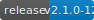

# Confluent Extension for VSCode

Our goal for the [Confluent extension for VS Code](https://github.com/confluentinc/vscode) is to
help make it very easy for developers to build stream processing applications using Confluent by
creating a robust, delightful experience for Confluent Cloud products accessible to developers from
within the [Visual Studio Code](https://code.visualstudio.com/) editor desktop environment.

Visit the [Confluent Developer site](https://developer.confluent.io/) for more about developing with
Confluent.

## Installation in VSCode

Within VSCode: search for Confluent in the Extensions sidebar and install the extension in your
editor from there. Or visit the
[Visual Studio Code Marketplace online](https://marketplace.visualstudio.com/vscode) to view,
download, and install the extension.

## Extension Settings

This extension exposes the following settings (see `contributes.configuration` in `package.json`):

- `confluent.debugging.showSidecarExceptions`: Whether or not to show notifications for errors
  detected while tailing sidecar process logs.

These can be seen by going to the extension settings directly inside VSCode.

## Telemetry

Gathering usage and error data helps us develop a more resilient and user friendly application. We
only enable telemetry in official production releases. We respect users' preferences for sending
telemetry data -- if a user has turned off telemetry in their VSCode settings, we skip sending any
events or data.

### Segment for user actions

We're using [Segment](https://segment.com/) to log extension usage. See `telemetry.ts` for
implementation & how it is used in the codebase. We send events when a user performs major actions
in the extention, such as using any of the registerd commands. This will help us see what commands
are popular, as well as answer other questions about how the extention is used so that we can make
it even more useful.

### Sentry for error tracing

We use [Sentry](https://sentry.io) to capture and analyze errors, in order to enable more robust and
developer friendly error debugging. It is the first item initialized in `extension.ts` so that it
can send any uncaught exceptions globally, and is invoked in certain catch blocks to send specific
errors. The [@sentry/rollup-plugin](#) is used to upload source maps.

## Additional References

- [Confluent Documentation](https://docs.confluent.io/index.html)
- [VSCode Extension Guidelines](https://code.visualstudio.com/api/references/extension-guidelines)

## Support

If you have any questions, comments, and/or run into any issues, feel free to post a message in
GitHub discussion [MAYBE? TODO needs update with actual instructions] or create an issue on the
repo.

## Contributing

Follow [CONTRIBUTING.md](/CONTRIBUTING.md) to for information on setting up your development
environment, how to propose bugfixes and improvements, and how to build and test your changes.

See our [Code of Conduct - coming soon](#TODO) for guidelines on what we expect from participants,
and what actions will and will not be tolerated.

## License
