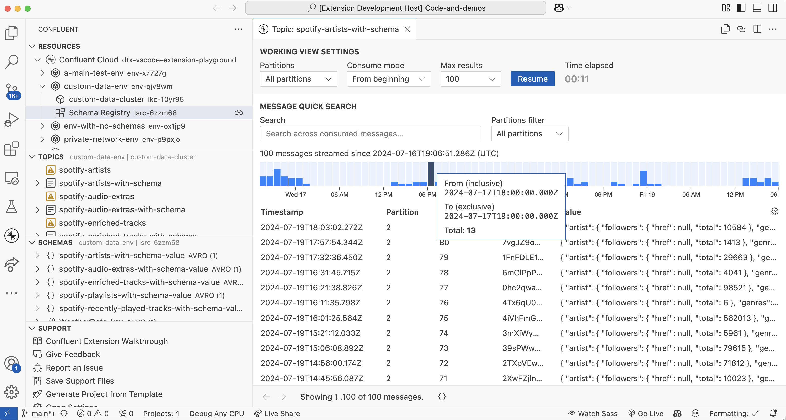

# Confluent for VS Code

The Confluent extension makes it easy for developers to build stream processing applications using
Confluent technology. This extension provides a robust, delightful experience for
[Confluent Cloud](https://confluent.cloud/) products from within the
[Visual Studio Code](https://code.visualstudio.com/) (VS Code) editor desktop environment.



Visit the [Confluent Developer site](https://developer.confluent.io/) for more about developing with
Confluent, and read the docs at the [Confluent documentation](https://docs.confluent.io/) site.

## Features

Confluent for VS Code provides a number of features for working with your Apache Kafka® compatible 
clusters and Confluent Schema Registry compatible servers.

The extension allows you to:

- [Work with your Confluent Cloud resources](#work-with-your-confluent-cloud-resources)
- [Generate streaming projects from Confluent-provided templates](#generate-streaming-projects-from-confluent-provided-templates)
- [Accelerate local development against Apache Kafka® and Confluent Schema Registry using Docker](#accelerate-local-development-against-apache-kafka-and-confluent-schema-registry-using-docker)
- [Inspect consumed messages in Kafka topics using Message Viewer](#inspect-consumed-messages-in-kafka-topics-using-message-viewer)
- [Produce messages to Kafka topics](#produce-messages-to-kafka-topics)
- [Explore, create and evolve schemas in Confluent Schema Registry](#explore-create-and-evolve-schemas-in-confluent-schema-registry)
- [Connect to any Apache Kafka® compatible cluster and any Confluent Schema Registry compatible server](#connect-to-any-apache-kafka-compatible-cluster-and-any-confluent-schema-registry-compatible-server)

## Documentation

### Work with your Confluent Cloud resources

<!-- <gif showing clicking sign in to confluent cloud, entering credentials and then getting redirected back to vscode -->
<!-- will resources populated, then clicking through an org -> env -> cluster (displays topics), then SR (displays schemsa)> -->

Log in to your Confluent Cloud account from Confluent for VS Code by clicking on sign in, and explore your Confluent Cloud
resources from right within VS Code.

> [!NOTE]
> If you would like to connect to your Confluent Cloud Kafka cluster and/or Confluent Cloud Schema Registry cluster
> using [API Key (user account or service account)](https://docs.confluent.io/cloud/current/security/authenticate/workload-identities/service-accounts/api-keys/overview.html#api-keys-and-ccloud-accounts), [Mutual TLS](https://docs.confluent.io/cloud/current/security/authenticate/workload-identities/identity-providers/mtls/overview.html), or [OAuth/OIDC](https://docs.confluent.io/cloud/current/security/authenticate/workload-identities/identity-providers/oauth/overview.html), then head to <anchor tag> for how to do that using the extension.

### Generate streaming projects from Confluent-provided templates

<!-- <gif showing clicking button, clicking on a template, fill in values, opening the project, and running it> -->

<!-- Some words about this. -->

### Accelerate local development against Apache Kafka® and Confluent Schema Registry using Docker

<!-- <gif showing clicking the play button to start local resources> -->

<!-- Some words about this. -->

<!-- Brief troubleshooting notes about Docker API version, lingering containers, etc. -->

### Inspect consumed messages in Kafka topics using Message Viewer

<!-- <gif showing messages streaming in, using histogram, clicking pause, scrolling down a bit clicking a message to open it> -->

Click the **play** icon next to the topic name to open the **Message Viewer**, which enables
searching and exploring messages in a topic. Within Message Viewer, you can:

- page through and search for specific values within the list of all the messages
- double-click a single message to explore the message headers, key and value encoded into JSON,
  along with additional metadata about the key and/or value schema that may have been used for
  deserialization
- pause and resume consuming at any time
- see aggregate counts of messages over time from the histogram view and brush to filter messages by
  timestamp
- toggle partitions on/off to show/hide messages from specific partitions

### Produce messages to Kafka topics

<!-- <gif showing a file open with message headers, key and value, click produce, choose value schema and produce> -->

1. Prepare a JSON file containing message `headers` (optional), `key` and `value` as top-level fields.
    <details><summary>Example of JSON file for producing message</summary>
    ```json
    {
      "headers": [
        {
          "key": "task.generation",
          "value": "350"
        },
        {
          "key": "task.id",
          "value": "0"
        },
        {
          "key": "current.iteration",
          "value": "39067914"
        }
      ],
      "key": 39067914,
      "value": {
        "ordertime": 1492152554633,
        "orderid": 39067914,
        "itemid": "Item_5",
        "orderunits": 7.508419592693289,
        "address": {
          "city": "City_84",
          "state": "State_85",
          "zipcode": 83204
        }
      }
    }
    ```
    </details>
1. Click the produce icon next to the topic name to open the Produce Message quickpick flow.
1. You will be prompted to choose a JSON file containing message `headers`, `key` and `value`.
1. Next, you will be prompted to choose whether to produce the message with/without a key/value schema. 
   Click OK to produce the message.
1. You will be notified of whether the produce was successful or not. If successful, you can head to
   the Message Viewer (click the magnifying glass icon against the topic) to 
   inspect the message you just produced.

#### Producing messages to topics using TopicRecordNameStrategy or RecordNameStrategy

<!-- <gif showing this> -->

If the Kafka topic you wish to produce a message to does not use [TopicNameStrategy](https://docs.confluent.io/platform/current/schema-registry/fundamentals/serdes-develop/index.html#overview), open the extension settings, look for "Confluent -> Topic -> Produce Messages -> Schemas: Use Topic Name Strategy" and disable this setting.

With it disabled, you will be prompted to select the Subject Name Strategy and the subject name while producing a message.

#### Producing messages to topics using a schema version earlier than the latest

<!-- <gif showing this> -->

If you wish to produce a message using a schema version earlier than the latest, open the extension settings and look for "Confluent -> Topic -> Produce Messages -> Schemas: Allow Older Versions" and enable it.

### Explore, create and evolve schemas in Confluent Schema Registry

#### Explore schemas

The **Schemas** view displays all the schemas available for the current Schema Registry cluster selected. 
Schemas are also shown in the **Topics** view by expanding a topic item if the subject name follows
either `TopicNameStrategy` or `TopicRecordNameStrategy` [schema naming strategies](https://docs.confluent.io/platform/current/schema-registry/fundamentals/serdes-develop/index.html#overview) and the user has the appropriate permissions.

Schema definitions can be viewed by expanding the schema subject to list all schema versions,
then clicking the on the specific schema version. You can also easily "View Latest Schema" by 
clicking the code file icon next to the subject.

#### Create/evolve schemas

You can create new schemas or update schemas and subject-bindings by creating or opening an `.avsc`,
`.proto`, or `.json` file, then using the **Cloud Upload** icon in the upper-right of the buffer
titlebar to begin the process of selecting a schema registry and subject to bind to. You can either
bind to new subjects or provide a revised/evolved schema for an existing subject to establish a new
version.

Search the marketplace for extensions to validate your Avro, JSON schema, or Protobuf syntax as
needed.

### Connect to any Apache Kafka® compatible cluster and any Confluent Schema Registry compatible server

Confluent for VS Code supports connecting to any Apache Kafka® compatible cluster and any Confluent
Schema Registry compatible server. 

Get started by clicking the "+" icon in the Resources view, and select "Enter manually" in the dropdown.
This opens a new tab containing a Connection form, configure your connection using the fields present.

<details><summary>Connection form details</summary>

#### General

| Form field | Description |
| ----- | ----- |
| Connection Name |  An easy to remember name to reference this connection in the Resources view |
| Connection Type | Choose from Apache Kafka®, Confluent Cloud, Confluent Platform, Warpstream, and Other. <br><br> This is used to narrow down the various fields available under [Kafka cluster](#kafka-cluster) and [Schema Registry](#schema-registry). |

#### Kafka Cluster

| Form field | Description |
| ----- | ----- |
| Bootstrap Server(s) |  One or more host:port pairs to use for establishing the initial connection (use a comma-separated list for more than one server). |
| Authentication Type | Choose from: <ul><li>Username & Password (SASL/PLAIN)</li><li>API Credentials (SASL/PLAIN)</li><li>SASL/SCRAM</li><li>SASL/OAUTHBEARER</li></ul>|
| SSL/TLS enabled checkbox | Use SSL/TLS encryption communication for data in transit between VS Code and the Kafka brokers. |
| [TLS Configuration](#tls-configuration) |  Additional TLS configuration, you may expand the TLS Configuration section and fill out Key Store and Trust Store details. |

#### Schema Registry

| Form field | Description |
| ----- | ----- |
| Bootstrap Server(s) |  One or more host:port pairs to use for establishing the initial connection (use a comma-separated list for more than one server). |
| Authentication Type | Choose from: <ul><li>Username & Password</li><li>API Credentials</li><li>OAuth</li></ul>|
| SSL/TLS enabled checkbox | Use SSL/TLS encryption communication for data in transit between VS Code and the Kafka brokers. |
| [TLS Configuration](#tls-configuration) |  Additional TLS configuration, you may expand the TLS Configuration section and fill out Key Store and Trust Store details. |


#### TLS Configuration

| Form field | Description |
| ----- | ----- |
| Verify Server Hostname | Enable verification of the broker host name matching the Distinguished Name (DN) in the broker's certificate. |
| [Key Store Configuration](#key-store-configuration) | Certificate used by Kafka brokers to authenticate the client. This is used to configure mutual TLS (mTLS) authentication. |
| [Trust Store Configuration](#trust-store-configuration) | Certificates for verifying SSL/TLS connections to the Kafka brokers. This is required if the Kafka brokers use a self-signed or a non-public Certificate Authority (CA). |

##### Key Store Configuration

Certificate used by Kafka brokers to authenticate the client. This is used to configure mutual TLS (mTLS) authentication.

| Form field | Description |
| ----- | ----- |
| Path | The path of the Key Store file. |
| Password | The store password for the Key Store file. Key Store password is not supported for PEM format. |
| Key Password | The password of the private key in the Key Store file. |
| Type | The file format of the Key Store file. Choose from PEM, PKCS12 and JKS. |

> [!TIP]
> Follow these steps to [configure mTLS authentication on Confluent Cloud](https://docs.confluent.io/cloud/current/security/authenticate/workload-identities/identity-providers/mtls/configure.html#steps-to-configure-mtls-authentication-on-ccloud?utm_source=vscode-ext)

##### Trust Store Configuration

Certificates for verifying SSL/TLS connections to the Kafka brokers. This is required if the Kafka brokers use a self-signed or a non-public Certificate Authority (CA).

| Form field | Description |
| ----- | ----- |
| Path | The path of the Trust Store file. |
| Password | The password for the Trust Store file. If a password is not set, the configured Trust Store file will still be used, but integrity checking of the Trust Store file is disabled. Trust Store password is not supported for PEM format. |
| Key Password | The password of the private key in the Key Store file. |
| Type | TThe file format of the Trust Store file. Choose from PEM, PKCS12 and JKS. |

> [!NOTE]
> Confluent Cloud employs TLS certificates from Let’s Encrypt, a trusted Certificate Authority (CA). For more information, see [Manage TLS Certificates](https://docs.confluent.io/cloud/current/cp-component/clients-cloud-config.html#manage-tls-certificates). Confluent Cloud does **not** support self-managed certificates for TLS encryption.

</details>

#### Support


The **Support** panel provides links to the extension walkthrough, issue reporting, general
feedback, and options to generate Kafka projects using a template.

## Installation

### From the Visual Studio Code Extension Marketplace

In your browser, go to the [VS Code Marketplace](https://marketplace.visualstudio.com/) to view,
download, and install the
[Confluent for VS Code](https://marketplace.visualstudio.com/items?itemName=confluentinc.vscode-confluent)
extension.

### From within VS Code

1. Open VS Code.

1. In the VS Code sidebar, click **Extensions** (`Cmd+Shift+X`/`Ctrl+Shift+X`).

1. In the **Extensions** view, search for "Confluent".

1. Click **Install**.

### From a `.vsix` file

_Note: This doc refers to the extension version as `x.x.x`. Ensure you replace this with the actual
version number you want to use, without the `v` prefix._

Confluent provides these VSIX files:

- MacOS with Apple Silicon: `vscode-confluent-darwin-arm64-x.x.x.vsix`
- MacOS with Intel processors: `vscode-confluent-darwin-x64-x.x.x.vsix`
- Linux on ARM-64 processors: `vscode-confluent-linux-arm64-x.x.x.vsix`
- Linux on x64 processors: `vscode-confluent-linux-x64-x.x.x.vsix`
- Windows on x64 processors: `vscode-confluent-windows-x64-x.x.x.vsix`

You can install the Confluent extension by using the VS Code UI or by using the
`code --install-extension` command in the terminal.

To install by using the UI with an online connection, follow these steps:

1. Download the VSIX file appropriate for your machine.

1. Open VS Code, and in the Sidebar, click **Extensions**.

1. At the top of the **Extensions** view, click **...**, and in the context menu, click **Install
   from VSIX…**

1. Navigate to your downloaded `vscode-confluent-vX.X.X.vsix` file and click **Install**.

To install in the terminal, run the following command:

```
code --install-extension /path/to/vscode-confluent-vX.X.X.vsix
```

### `.vsix` file installation via offvsix

If you have been struggling with pre-downloading extension payloads (and assuming you have
[python](https://www.python.org/), [pip](https://pypi.org/project/pip/), and
[offvsix](https://github.com/gni/offvsix), you can follow these steps:

```
mkdir offvsix
cd offvsix

python3 -m venv .
. bin/activate

pip install offvsix

offvsix confluentinc.vscode-confluent
```

## Outputs

Once the Confluent extension is activated, you can view extension logs in two separate Output
Channels:

- **Confluent**: logs for the VS Code extension itself
- **Confluent (Sidecar)**: logs from the
  [Sidecar process](https://github.com/confluentinc/ide-sidecar)

## Telemetry

Gathering usage and error data helps Confluent develop a more resilient and user friendly
application. Confluent enables telemetry only in official production releases. Confluent respect
users' preferences for sending telemetry data -- if you have turned off telemetry in your VS Code
settings, the extension doesn't send any events or data.

### Segment for user actions

The extension uses [Segment](https://segment.com/) to log extension usage. See `telemetry.ts` for
implementation and how it is used in the codebase. The extension sends events when you perform major
actions in the extension, such as using any of the registerd commands. This helps Confluent see what
commands are popular and helps to answer other questions about how the extension is used, so
Confluent can make it even more useful.

### Sentry for error tracing

The extension uses [Sentry](https://sentry.io) to capture and analyze errors, which enables more
robust and friendly error debugging. It is the first item initialized in `extension.ts`, so that it
can send any uncaught exceptions globally, and it's invoked in certain catch blocks to send specific
errors. The [@sentry/rollup-plugin](#) is used to upload source maps.

## Additional References

- [Confluent Documentation](https://docs.confluent.io/index.html)
- [VS Code Extension Guidelines](https://code.visualstudio.com/api/references/extension-guidelines)

## Known Limitations

- Confluent Cloud connections require reauthenticating after 8 hours, and you will be prompted to
  reauthenticate.
  - Signing out of Confluent Cloud through the browser will also sign you out of the Confluent
    extension.
- Preview links for non-default organizations work only after switching to the non-default
  organization in the Confluent Cloud UI in your browser.
- When using multiple users on a single machine, only one user can run the extension at a time.
- Searching for schemas in the Topics and Schemas views is limited to the `subject` field only.
  Searching by other fields, such as `id` and `version`, is not supported due to cost and
  performance considerations.
- The Message Viewer does not support consuming records that were compressed with `snappy` except
  for Confluent Cloud connections
  ([confluentinc/ide-sidecar#304](https://github.com/confluentinc/ide-sidecar/issues/304)).
- Starting the extension in one IDE (e.g., VS Code) and then starting it in another IDE (e.g. VS
  Code Insiders) will cause conflicts with the sidecar process. The first IDE establishes a
  handshake with the sidecar and stores an access token, while the second IDE attempts to kill the
  existing sidecar process and obtain a new token, resulting in the two different IDEs fighting for
  control. Only one type of IDE can run the extension at a time, though you can still use multiple
  windows/workspaces of the same IDE type.

## Support

If you have any questions, comments, or you run into any issues, feel free to post a message in a
GitHub [discussion](https://github.com/confluentinc/vscode/discussions) or create an
[issue](https://github.com/confluentinc/vscode/issues).

For general feedback, fill out and submit the [survey](https://www.surveymonkey.com/r/NYVKQD6).

## Contributing

Follow [CONTRIBUTING.md](/CONTRIBUTING.md) for information on setting up your development
environment, proposing bugfixes and improvements, and building and testing your changes.

See the [Code of Conduct](/CODE_OF_CONDUCT.md) for guidelines on what Confluent expects from
participants, and what actions will and will not be tolerated.

## License

This project is licensed under the Apache License, Version 2.0. See [LICENSE.txt](/LICENSE.txt) for
the full license text.

The LICENSE.txt and NOTICE.txt covers the source code distributions of this project. The LICENSE.txt
and NOTICE-vsix.txt covers the VSIX archive distribution of this project (the VS Code Extension).
The THIRD_PARTY_NOTICES.txt file contains the list of third-party software that is included in the
VSIX archive distribution of this project, along with the full text of applicable licenses.
