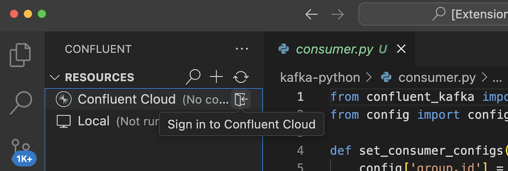
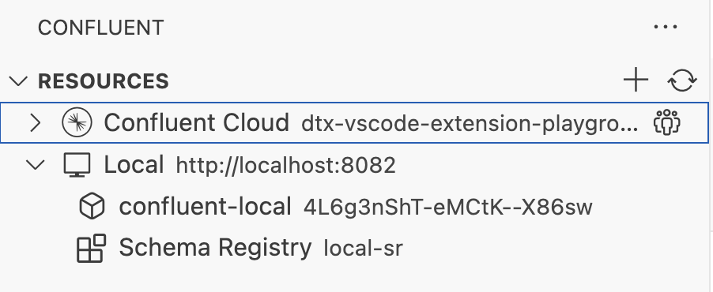

# Confluent for VS Code

The Confluent extension makes it easy for developers to build stream processing applications using
Confluent technology. This extension provides a robust, delightful experience for
[Confluent Cloud](https://confluent.cloud/) products from within the
[Visual Studio Code](https://code.visualstudio.com/) (VS Code) editor desktop environment.


Visit the [Confluent Developer site](https://developer.confluent.io/) for more about developing with
Confluent, and read the docs at the [Confluent documentation](https://docs.confluent.io/) site.

## Features

Confluent for VS Code provides a number of features for working with your Kafka clusters, topics and
schemas.

> Confluent for VS Code is available for Early Access, and some Confluent features may not be
> available. Consider installing the
> [Confluent CLI](https://docs.confluent.io/confluent-cli/current/overview.html) to access all
> features of Confluent Cloud.

### Command Palette

Most of the Confluent extension features are available in the VS Code Command Palette. Press
`Cmd+Shift+P`/`Ctrl+Shift+P` and type "confluent" to show the Confluent extension commands.

Some commands are associated with view actions, which are the simple buttons (usually icons) next to
items in the Sidebar. For example, **play** (open Message Viewer and start consuming messages),
**sync** (refresh), and **ellipsis** (extra actions) are all view actions associated with commands
available in the command palette.

### Sidebar

In the Sidebar, click the Confluent logo to open the extension and show the following sections.

#### Connect to your streams

Confluent for VS Code supports accessing your Apache Kafka® clusters locally or on Confluent Cloud.

- To start a local Kafka cluster,
  [install the Confluent CLI](https://docs.confluent.io/confluent-cli/current/overview.html) and run
  the
  [`confluent local kafka start` command](https://docs.confluent.io/confluent-cli/current/command-reference/local/kafka/confluent_local_kafka_start.html).
- If you're working on Confluent Cloud, open the Confluent extension and click **Connect to
  Confluent Cloud** or go to the VS Code Accounts menu and click "Sign in with Confluent Cloud to
  use Confluent".

  

#### Resources



The **Resources** view lists Confluent Cloud environments and associated Kafka and Schema Registry
clusters, as well as local Kafka clusters.

- Click a Kafka cluster to load the topics created in that cluster in the Topics view.
- Click a Schema Registry to load the associated schemas for that registry in the Schemas view.

#### Topics


Click the **play** icon next to the topic name to open the **Message Viewer**, which enables
searching and exploring messages in a topic. Within Message Viewer, you can:

- page through and search for specific values within the list of all the messages
- double-click a single message to explore its entire payload encoded into JSON
- pause and resume consuming at any time
- see aggregate counts of messages over time from the histogram view and brush to filter messages by
  timestamp
- toggle partitions on/off to show/hide messages from specific partitions

#### Schemas


##### View

The **Schemas** view displays all the schemas available for the current Confluent Cloud
environment's Schema Registry. Schemas are also shown in the **Topics** view by expanding a topic
item if they match using either `TopicNameStrategy` or `TopicRecordNameStrategy`
[schema naming strategies](https://docs.confluent.io/platform/current/schema-registry/fundamentals/serdes-develop/index.html#overview)
and the user has the appropriate permissions.

Schema definitions can be viewed by expanding the schema subject to see a specific schema version,
then clicking the **View Schema** icon.

##### Create / Evolve

You can create new schemas or update schemas and subject-bindings by creating or opening an `.avsc`,
`.proto`, or `.json` file, then using the **Cloud Upload** icon in the upper-right of the buffer
titlebar to begin the process of selecting a schema registry and subject to bind to. You can either
bind to new subjects or provide a revised/evolved schema for an existing subject to establish a new
version.

Search the marketplace for extensions to validate your Avro, JSON schema, or Protobuf syntax as
needed.

#### Support


The **Support** panel provides links to the extension walkthrough, issue reporting, general
feedback, and options to generate Kafka projects using a template.

## Installation

### From the Visual Studio Code Extension Marketplace

In your browser, go to the [VS Code Marketplace](https://marketplace.visualstudio.com/) to view,
download, and install the
[Confluent for VS Code](https://marketplace.visualstudio.com/items?itemName=confluentinc.vscode-confluent)
extension.

### From within VS Code

1. Open VS Code.

1. In the VS Code sidebar, click **Extensions** (`Cmd+Shift+X`/`Ctrl+Shift+X`).

1. In the **Extensions** view, search for "Confluent".

1. Click **Install**.

### From a `.vsix` file

_Note: This doc refers to the extension version as `x.x.x`. Ensure you replace this with the actual
version number you want to use, without the `v` prefix._

Confluent provides these VSIX files:

- MacOS with Apple Silicon: `vscode-confluent-darwin-arm64-x.x.x.vsix`
- MacOS with Intel processors: `vscode-confluent-darwin-x64-x.x.x.vsix`
- Linux on ARM-64 processors: `vscode-confluent-linux-arm64-x.x.x.vsix`
- Linux on x64 processors: `vscode-confluent-linux-x64-x.x.x.vsix`
- Windows on x64 processors: `vscode-confluent-windows-x64-x.x.x.vsix`

Additionally, for Windows ARM-64, you may use Windows Subsystem for Linux
[WSL](https://learn.microsoft.com/en-us/windows/wsl/install) with the Linux ARM-64 .vsix file.

You can install the Confluent extension by using the VS Code UI or by using the
`code --install-extension` command in the terminal.

To install by using the UI with an online connection, follow these steps:

1. Download the VSIX file appropriate for your machine.

1. Open VS Code, and in the Sidebar, click **Extensions**.

1. At the top of the **Extensions** view, click **...**, and in the context menu, click **Install
   from VSIX…**

1. Navigate to your downloaded `vscode-confluent-vX.X.X.vsix` file and click **Install**.

To install in the terminal, run the following command:

```
code --install-extension /path/to/vscode-confluent-vX.X.X.vsix
```

### `.vsix` file installation via offvsix

If you have been struggling with pre-downloading extension payloads (and assuming you have [python](https://www.python.org/), [pip](https://pypi.org/project/pip/), and [offvsix](https://github.com/gni/offvsix), you can follow these steps:

```
mkdir offvsix
cd offvsix

python3 -m venv .
. bin/activate

pip install offvsix

offvsix confluentinc.vscode-confluent
```

## Outputs

Once the Confluent extension is activated, you can view extension logs in two separate Output
Channels:

- **Confluent**: logs for the VS Code extension itself
- **Confluent (Sidecar)**: logs from the
  [Sidecar process](https://github.com/confluentinc/ide-sidecar)

## Telemetry

Gathering usage and error data helps Confluent develop a more resilient and user friendly
application. Confluent enables telemetry only in official production releases. Confluent respect
users' preferences for sending telemetry data -- if you have turned off telemetry in your VS Code
settings, the extension doesn't send any events or data.

### Segment for user actions

The extension uses [Segment](https://segment.com/) to log extension usage. See `telemetry.ts` for
implementation and how it is used in the codebase. The extension sends events when you perform major
actions in the extension, such as using any of the registerd commands. This helps Confluent see what
commands are popular and helps to answer other questions about how the extension is used, so
Confluent can make it even more useful.

### Sentry for error tracing

The extension uses [Sentry](https://sentry.io) to capture and analyze errors, which enables more
robust and friendly error debugging. It is the first item initialized in `extension.ts`, so that it
can send any uncaught exceptions globally, and it's invoked in certain catch blocks to send specific
errors. The [@sentry/rollup-plugin](#) is used to upload source maps.

## Additional References

- [Confluent Documentation](https://docs.confluent.io/index.html)
- [VS Code Extension Guidelines](https://code.visualstudio.com/api/references/extension-guidelines)

## Known Limitations

- Confluent Cloud connections require reauthenticating after 8 hours, and you will be prompted to
  reauthenticate.
  - Signing out of Confluent Cloud through the browser will also sign you out of the Confluent
    extension.
- Preview links for non-default organizations work only after switching to the non-default
  organization in the Confluent Cloud UI in your browser.
- When using multiple users on a single machine, only one user can run the extension at a time.
- Searching for schemas in the Topics and Schemas views is limited to the `subject` field only.
  Searching by other fields, such as `id` and `version`, is not supported due to cost and
  performance considerations.
- The Message Viewer does not support consuming records that were compressed with `snappy`
  except for Confluent Cloud connections.

## Support

If you have any questions, comments, or you run into any issues, feel free to post a message in a
GitHub [discussion](https://github.com/confluentinc/vscode/discussions) or create an
[issue](https://github.com/confluentinc/vscode/issues).

For general feedback, fill out and submit the [survey](https://www.surveymonkey.com/r/NYVKQD6).

## Contributing

Follow [CONTRIBUTING.md](/CONTRIBUTING.md) for information on setting up your development
environment, proposing bugfixes and improvements, and building and testing your changes.

See the [Code of Conduct](/CODE_OF_CONDUCT.md) for guidelines on what Confluent expects from
participants, and what actions will and will not be tolerated.

## License

This project is licensed under the Apache License, Version 2.0. See [LICENSE.txt](/LICENSE.txt) for
the full license text.

The LICENSE.txt and NOTICE.txt covers the source code distributions of this project. The LICENSE.txt
and NOTICE-vsix.txt covers the VSIX archive distribution of this project (the VS Code Extension).
The THIRD_PARTY_NOTICES.txt file contains the list of third-party software that is included in the
VSIX archive distribution of this project, along with the full text of applicable licenses.
