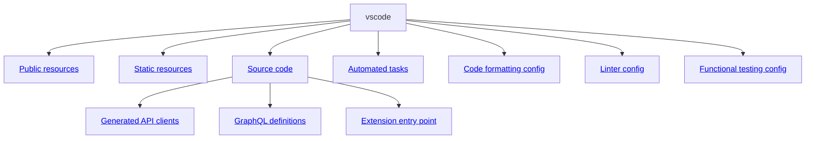

# Confluent For VS Code Contributing Guide 📖

We are grateful for your interest in contributing to the Confluent VSCode extension. This guide includes information on: 
- [getting started for the first time](#getting-started-for-the-first-time)
- as well as a [quick reference](#reference-for-contributors) for contributors who need refreshers on the process

The best developers are those who are familiar with the user experience of the software they create, so we ask that you review the project's [official documentation](https://docs.confluent.io/cloud/current/client-apps/vs-code-extension.html) before diving in.

There are three main ways to contribute:

1. **File an Issue**
    - You can report bugs, request features, or ask questions by filing an issue in our [GitHub repository](https://github.com/confluentinc/vscode/issues).
2. **Submit or Review Pull Requests (PR)**
    - In this case, we ask that you read the rest of this guide to understand the process and requirements for contributing code.
3. **Ask A Question Or Contribute to a Discussion**
   - Use our [GitHub Discussions](https://github.com/confluentinc/vscode/discussions/) page to participate in the conversation around the extension's development. As always, we ask that you follow our [Code of Conduct](https://github.com/confluentinc/vscode/blob/cc4f9e149bca18776bd9dfdbcf241de332495dfc/CODE_OF_CONDUCT.md#L4).

## Getting Started For the First Time

Quicklinks:

- [Project Overview](#project-overview)
- [Codebase Overview](#codebase-overview)
- [Issues](#issues)
- [Tools and Prerequisites](#tools-and-prerequisites)
- [One Time Setup and Pull Requests](#one-time-setup-and-pull-requests)
- [Testing](#testing)

### Project Overview

Our README contains a project overview, including a description of the extension's features and functionality. You can find it [on the main page of the repository](https://github.com/confluentinc/vscode?tab=readme-ov-file#confluent-for-vs-code). Again, you can also find the official documentation for the extension [on the Confluent website](https://docs.confluent.io/cloud/current/client-apps/vs-code-extension.html).

### Codebase Overview



### Issues

You can [report problems or comment on issues](https://github.com/confluentinc/vscode/issues)
without installing the tools, getting the code, or building the code. All you need is a GitHub
account.

#### Create a new issue

If you spot a problem with the app, code, or docs
[search if an issue already exists](https://docs.github.com/en/github/searching-for-information-on-github/searching-on-github/searching-issues-and-pull-requests#search-by-the-title-body-or-comments).
If a related issue doesn't exist, you can open a new issue using a relevant
[issue form](https://github.com/confluentinc/vscode/issues/new/choose).

#### Solve an issue

Scan through our [existing issues](https://github.com/github/confluentinc/vscode/issues) to find one
that interests you. You can narrow down the search using `labels` as filters. See
"[Label reference](https://docs.github.com/en/contributing/collaborating-on-github-docs/label-reference)"
for more information. As a general rule, you are welcome to open a PR with a fix unless that issue
is already assigned to someone else, or someone else has added a comment that they are working on
it. Currently unassigned issues can be found using
[this filter](https://github.com/confluentinc/vscode/issues?q=is%3Aissue%20state%3Aopen%20no%3Aassignee%20-label%3Arelease%20).

### One Time Setup and Pull Requests

All changes are made through [pull requests (PRs)](https://github.com/confluentinc/vscode/pulls).
Every PR's [Semaphore CI/CD build](https://semaphoreci.com/) must pass. The Confluent team will
review PRs and provide feedback; once the changes in the PR are acceptable, the team will merge the
PR onto the appropriate branch. 

> Note that while a [SonarQube report](https://docs.sonarsource.com/sonarqube-server/10.8/analyzing-source-code/ci-integration/overview/) of less than 80% code coverage will not block a PR, we do expect that the code coverage will improve with each PR. A member of the Confluent team will need to comment "/sem-approve" on the PR to approve external PRs for merging.

To create a PR, you must create a fork of this repository and set up your machine with the tools
needed for development. These steps are outlined below.

#### Checklist:

- [ ] Install the required tools and dependencies (see [Tools and Prerequisites](#tools-and-prerequisites)).
- [ ] [Clone your fork](#clone-your-fork) of the repository.
- [ ] Set up your local Git repository to track the upstream repository, learn to build, clean and format locally (see [Sync your repo with ours](#sync-your-repo-with-oours)).

### Tools and Prerequisites


If you want to work with this project's codebase and maybe contribute to it, you will need to have
some development tools. We use GitHub, so [consult the GitHub docs](https://docs.github.com/en/get-started/using-github/github-flow) if you are unfamiliar with the GitHub flow. This project uses the following software that you may already have:

- [Git](https://git-scm.com) — version 2.40.0 or later
- [Node.js](https://nodejs.org/en) — version 18.12.0 or later. It usually installs
  [NPM](https://www.npmjs.com) alongside
- [Visual Studio Code](https://code.visualstudio.com) — version 1.87.0 or later

See the links above for installation instructions on your platform. You can verify the versions you
have installed and that they are working.

```bash
    git --version
```

should be at least `2.40.0` or later,

```bash
    node --version
```

should be `18.12.0` or later, and

```bash
    code --version
```

should be `1.87.0` or later. See
[VS Code Command Line Interface Guide](https://code.visualstudio.com/docs/editor/command-line) for
more information about `code` command usage.

The project also uses these tools:

- [NVM](https://github.com/nvm-sh/nvm) — optional, Node.js version manager.
- [Gulp](https://gulpjs.com) — task automation tool. It is installed along with other Node.js
  dependencies, but you may want to install a global CLI package as well:

```bash
      npm install -g gulp
```

#### Other services

The project also uses several services:

- [GitHub](https://github.com) — this project is on GitHub, so to contribute you'll need a GitHub
  account.
- [Semaphore CI/CD](https://semaphoreci.com/) — continuous integration and deployment service. You
  should not need an account.

### Clone your fork

#### Fork this repository

Go to [this repository on GitHub](https://github.com/confluentinc/vscode) and click the "Fork"
button near the upper right corner of the page. Complete the form and click the "Create fork" button
to create your own https://github.com/YOUR-USERNAME/vscode repository. This is the repository to
which you will upload your proposed changes and create pull requests. See the
[GitHub documentation](https://docs.github.com/en/pull-requests/collaborating-with-pull-requests/working-with-forks/fork-a-repo)
for details.


To work locally on the code, you need to pull the code onto your machine. At a terminal, go to the
directory in which you want to place a local clone of this repository, and run the following
commands to use SSH authentication (recommended):

```bash
    git clone git@github.com:YOUR-USERNAME/vscode.git
```

or with HTTPS:

```bash
    git clone https://github.com/YOUR-USERNAME/vscode.git
```

This will create a `vscode` directory and pull the contents of your forked repository. Change into
that directory:

```bash
    cd vscode
```

### Sync your repo with ours


If you intend to propose changes to our upstream repository, you should next configure your local
repository to be able to pull code from the project's _remote_ repository, called the _upstream_
repository.

Use the following command to see the current remotes for your fork:

```bash
    git remote -v
```

which will output something like:

```bash
    origin  git@github.com:YOUR-USERNAME/vscode.git (fetch)
    origin  git@github.com:YOUR-USERNAME/vscode.git (push)
```

or if you used HTTPS:

```bash
    origin  https://github.com/YOUR-USERNAME/vscode.git (fetch)
    origin  https://github.com/YOUR-USERNAME/vscode.git (push)
```

Then run the following command to add the project's repository as a remote called `upstream`:

```bash
    git remote add upstream git@github.com:confluentinc/vscode.git
```

or if you've used HTTPS:

```bash
    git remote add upstream https://github.com/confluentinc/vscode.git
```

To verify the new upstream repository you have specified for your fork, run this command again:

```bash
    git remote -v
```

You should see the URL for your fork as `origin`, and the URL for the project's upstream repository
as `upstream`. If you used SSH, this will look something like:

```bash
    origin  git@github.com:YOUR-USERNAME/vscode.git (fetch)
    origin  git@github.com:YOUR-USERNAME/vscode.git (push)
    upstream  git@github.com:confluentinc/vscode.git (fetch)
    upstream  git@github.com:confluentinc/vscode.git (push)
```

#### Get the latest upstream code

Once setup, you can periodically sync your fork with the upstream repository, using just a few Git
commands. The most common way is to keep your local `main` branch always in sync with the _upstream_
repository's `main` branch:

```bash
    git checkout main
    git fetch upstream
    git pull upstream main
```

You can create local branches from `main` and do your development there.

> [!NOTE]  
> You don't need to keep the `main` branch on your remote https://github.com/YOUR-USERNAME/vscode
> repository in sync, but you can if you want:
>
>     git push origin main

For more details and other options, see
"[Syncing a fork](https://docs.github.com/en/pull-requests/collaborating-with-pull-requests/working-with-forks/syncing-a-fork)"
in GitHub's documentation.

#### Install dependencies

To install frontend-related dependencies, use NPM:

```bash
    npm ci
```

We recommend using `npm ci` over `npm install` so you'd get reproducible state of dependencies
defined by `package-lock.json`.

#### Building locally

Now that you have the source code and installed all the tools, you can build the project locally.
First check out the `main` branch:

```bash
    git checkout main
```

and pull the latest changes from the _project's repository_:

```bash
    git pull upstream main
```

Now you can compile the extension code:

```bash
    gulp build
```

When using VS Code, you can run the extension using Run and Debug tab. The project includes
necessary configs in `.vscode` folder to define what needs to be done for the extension to run in
debug mode.

To check the code against style conventions and potential bugs:

```bash
    gulp lint
    gulp check
```

To get a brief overview of existing automated tasks:

```bash
    gulp --tasks
``` 

#### Cleaning

The build will create a lot of local files. You can clean up these generated files with:

```bash
    gulp clean
```

Cleaning is often useful to ensure that all generated files, JARs and executables are removed,
before rerunning the build and tests.

#### Formatting

We use [Prettier](https://prettier.io/) for code formatting. To format the code, run:

```bash
    gulp format
``` 

You can also install the
[Prettier extension for VS Code](https://marketplace.visualstudio.com/items?itemName=esbenp.prettier-vscode)
which will format `typescript` documents **on save** based on the `.prettierrc` and
`.vscode/settings.json` files in the project.

### Testing

This project uses unit tests and integration tests to verify functionality and identify regressions.

#### Unit tests

Unit tests usually located next to modules they cover. Look for `xxx.test.ts` pattern of files in
`src` folder. We use [Mocha](https://mochajs.org) for writing unit tests. To run the existing tests:

```bash
    gulp test
``` 

You can also specify a pattern (either for `describe` label or `it` labels) to lookup to run
specific tests:

```bash
    gulp test -t 'should register all commands'
    gulp test -t 'Extension manifest tests'
``` 

Unit tests should test small, isolated classes and functionality, and should not be unnecessarily
complex.

#### Running a single unit test

You can run individual unit tests by using the following syntax:

```bash
    gulp test -t 'should register all commands'
    gulp test -t 'Extension manifest tests'
```

Or by adding `.only` after a `describe` or `it` block in the test file:

```typescript
describe.only('Extension manifest tests', () => {
  it('should register all commands', () => {
    // test code
  });
});
```

Remember to remove `.only` after running the test and before making a PR! 

#### Functional tests

Functional tests are written for the content the extension display in Web views. These tests run
using [Playwright Test](https://playwright.dev) framework. The tests cover UI behavior of the Web
views content from perspective of the user interacting with them. To run the tests, use respective
task:

```bash
    gulp functional
```

#### E2E tests

End-to-end (E2E) tests are written for the extension's functionality in a real VS Code environment.
These tests use [Playwright with Electron](https://playwright.dev/docs/api/class-electron) to launch
VS Code and interact with it programmatically. The tests are located in the
[`tests/e2e`](../tests/e2e) directory.

Go to [E2E Tests using Playwright](../tests/README.md#e2e-tests-using-playwright) section for more
information on running, debugging and writing E2E tests.

In short, to run the E2E tests, use the following command:

```bash
    gulp e2e
```

#### Running the tests

To run unit tests:

```bash
    gulp test
```

To run functional tests:

```bash
    gulp functional
```


## Reference for Contributors

### Release Process

Most development occurs on the `main` branch. Therefore, most PRs will target the `main` branch, and
be merged to the `main` branch. We use [semantic versioning](https://semver.org/), so our version
numbers are of the form `v.MAJOR.MINOR.PATCH`, such as `v1.2.0`. We will release all major and minor
releases from the `main` branch.

If we need to patch a previously-released major or minor release, we will create a `v.MAJOR.MINOR.x`
branch (e.g., `v1.2.x`), and we create PRs against this branch for all fixes and changes. When the
patch is ready, we'll release the first `v.MAJOR.MINOR.1` patch version (e.g., `v1.2.1`). If we need
to make additional fixes, we'll continue to do so against this same branch and release subsequent
patch versions (e.g., `v1.2.2`, `v1.2.3`, etc).

This project's releases will be published to [GitHub releases](https://github.com/confluentinc/vscode/releases).

### Updating OpenAPI clients

We use [`openapi-generator-cli`](https://openapi-generator.tech/docs/usage) with the
[`typescript-fetch` generator](https://openapi-generator.tech/docs/generators/typescript-fetch/) to
create the client code from [OpenAPI specs](https://www.openapis.org/what-is-openapi).

The generated client code helps to make requests to the services defined in the OpenAPI specs
without needing to manually write the request/response structures, middlewares, handlers, and more.

#### Generating the client code

To generate the client code, run the `apigen` task:

```bash
    gulp apigen
```

This task generates the client code for all OpenAPI specs in the `src/clients` directory.

#### Adding a new OpenAPI spec

1. Copy the associated OpenAPI spec file(s) to the `src/clients` directory.
   - For requests handled by the sidecar\*, place them in the `src/clients/sidecar-openapi-specs`
     directory.
   - For other requests (like to the local Docker engine API), place them in the `src/clients`
     directory.
2. Update the `apigen` task's `clients` array in the
   [`Gulpfile.js`](https://github.com/confluentinc/vscode/blob/main/Gulpfile.js) to include the path
   of the new OpenAPI spec file(s) and their destination directory. For example:

```diff
const clients = [
  // existing clients
  ["src/clients/sidecar-openapi-specs/sidecar.openapi.yaml", "src/clients/sidecar"],
  ["src/clients/sidecar-openapi-specs/ce-kafka-rest.openapi.yaml", "src/clients/kafkaRest"],
  ["src/clients/sidecar-openapi-specs/schema-registry.openapi.yaml", "src/clients/schemaRegistryRest"],
  ["src/clients/sidecar-openapi-specs/scaffolding-service.openapi.yaml", "src/clients/scaffoldingService"],
- ["src/clients/docker.openapi.yaml", "src/clients/docker"]
+ ["src/clients/docker.openapi.yaml", "src/clients/docker"],
+ ["src/clients/sidecar-openapi-specs/new-service-openapi.yaml", "src/clients/newService"],
];
```

3. Run the `apigen` task:

```
   gulp apigen
```

\*_For sidecar-handled requests, update
[`SidecarHandle`](https://github.com/confluentinc/vscode/blob/main/src/sidecar/sidecarHandle.ts)
with any custom headers and/or other configurations._

#### Manual adjustments to OpenAPI specs

Sometimes, we need to make manual adjustments to OpenAPI specs before generating the client code. To
ensure these changes are not lost, we have a
[`src/clients/sidecar-openapi-specs/patches` directory](https://github.com/confluentinc/vscode/tree/main/src/clients/sidecar-openapi-specs/patches)
where we can store these changes as `.patch` files.

The `apigen` task tries to apply these patches to the OpenAPI specs before generating the client
code by using a glob pattern to find all `.patch` files in the `patches` directory.

### Updating GraphQL definitions

We use GraphQL queries to the sidecar process to retrieve information about available connections
and their resources, such as environments, Kafka clusters, Schema Registry instances, and Flink
compute pools.

To enable type-safe GraphQL operations, we rely on [`gql.tada`](https://gql-tada.0no.co/) to
generate TypeScript types from our GraphQL schema. The
[`src/graphql/sidecar.graphql`](https://github.com/confluentinc/vscode/blob/main/src/graphql/sidecar.graphql)
file contains the GraphQL schema for the sidecar, which is used to generate the TypeScript
declarations file at
[`src/graphql/sidecarGraphQL.d.ts`](https://github.com/confluentinc/vscode/blob/main/src/graphql/sidecarGraphQL.d.ts).

**This file is auto-generated and should not be edited manually.**

Usually, type generation will be done automatically based on `tsconfig.json`. If you update the
schema and need to manually regenerate `sidecarGraphQL.d.ts`, run the following command from the
root of the repository:

```bash
npx gql-tada generate output
```

(Or re-run `gulp apigen`.)

See the
[`gql.tada` documentation](https://gql-tada.0no.co/get-started/workflows#generating-the-output-file)
for more details.

### Updating NOTICE files

<!-- prettier-ignore -->
> [!NOTE]
> The LICENSE.txt file contains the full text of the Apache License, Version 2.0. This file
> will never need to be updated.

A Semaphore CI/CD pipeline (See "Update third party notices PR" block in `.semaphore/semaphore.yml`)
automatically raises a Pull Request to update the `THIRD_PARTY_NOTICES.txt` and `NOTICE-vsix.txt`
files, on the following conditions (when a PR is merged into the `main` branch or a release branch,
e.g., `v1.2.x`):

- Any change to the `package.json` file (e.g., adding a new dependency, updating an existing one)
- Any change to the `NOTICE.txt` file
- Any change to the `scripts/notices/NOTICE-vsix_PREAMBLE.txt` file

The pipeline calls the `make update-third-party-notices-pr` target, which in turn calls the
following targets:

- `make generate-third-party-notices` to generate the `THIRD_PARTY_NOTICES.txt` file
- `make collect-notices-vsix` to generate the `NOTICE-vsix.txt` file: Appends `NOTICE.txt`,
  `scripts/notices/NOTICE-vsix_PREAMBLE.txt`, and `NOTICE*` files from all dependency NPM packages.

The PR raised must be summarily reviewed and merged by a maintainer. The PR title will be suffixed
with `[ci skip]` to avoid triggering the pipeline again.
