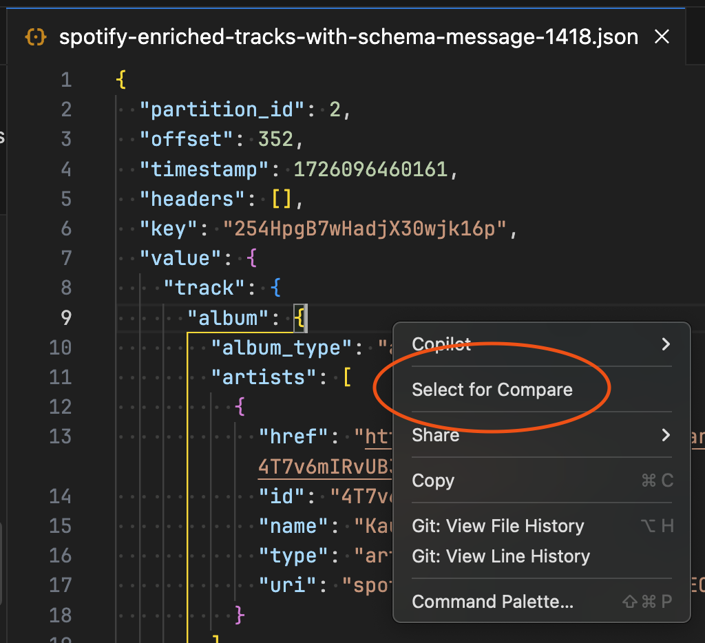
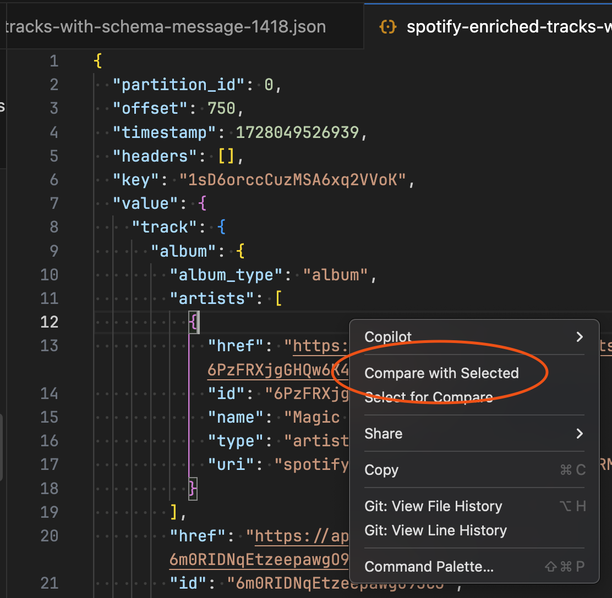
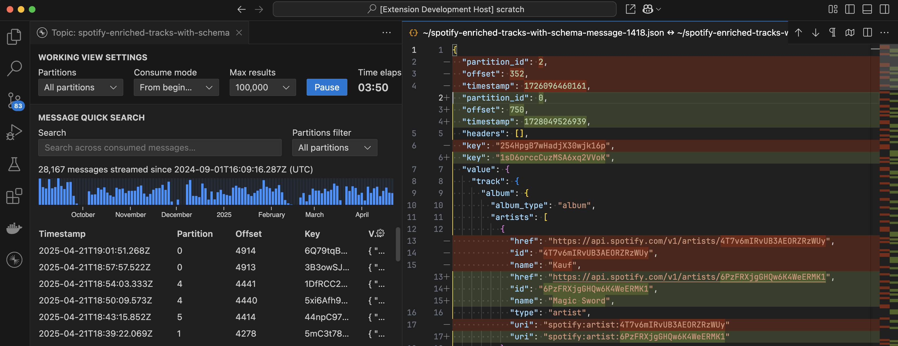
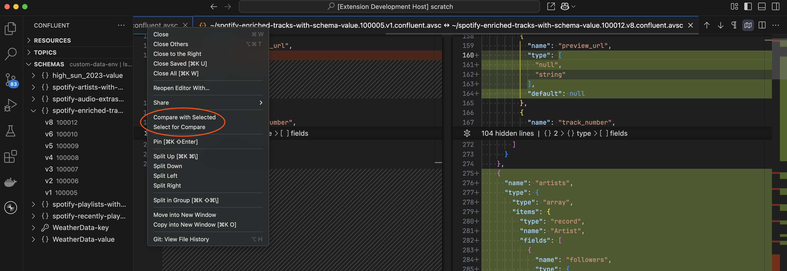
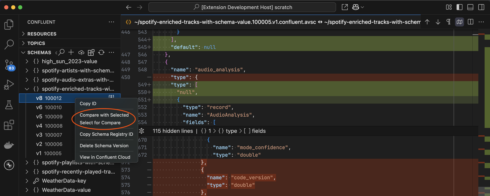

The Confluent extension provides read-only document views for schema definitions and topic message
previews. You can compare them using VS Code's built-in diff viewer:

## From the document context menu

1. **Select the first document:** Right-click inside a document and select _"Select for Compare"_
   from the context menu. 

2. **Compare with the second document:** Right-click inside another document and select _"Compare
   with Selected"_ from the context menu. 

3. VS Code will open a side-by-side diff view showing both documents with their differences
   highlighted. 

## From the editor tab title

You can also access these actions by right-clicking on a document's **tab**:

## From the sidebar

For schema versions, you can access the same commands by right-clicking individual **schema
versions** in the [**Schemas** view](command:confluent-schemas.focus) in the sidebar:

## Tips

- The diff view is **read-only** but lets you easily spot differences between messages or schema
  versions
- Use the diff viewer navigation arrows to jump between changes
- Schema comparisons are particularly useful when evolving schemas to ensure compatibility
