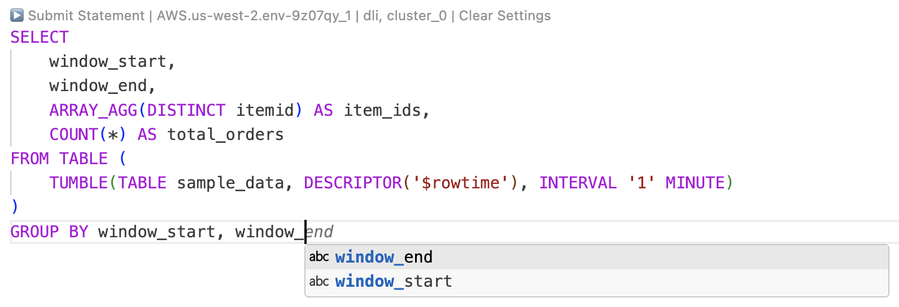
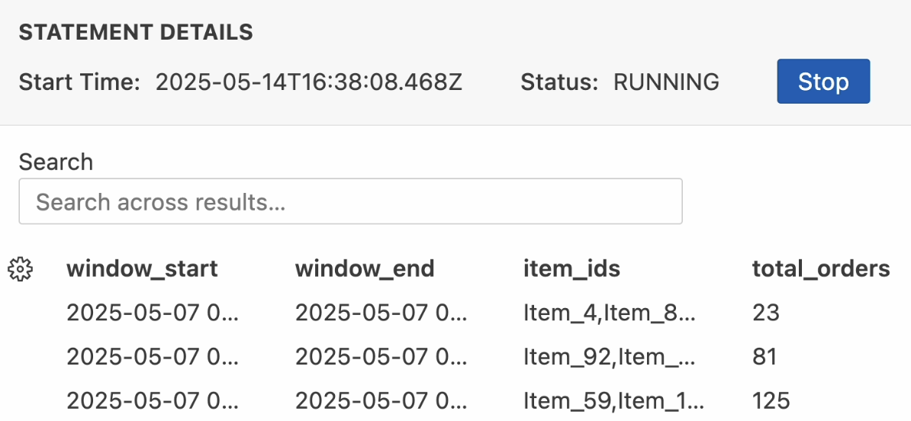
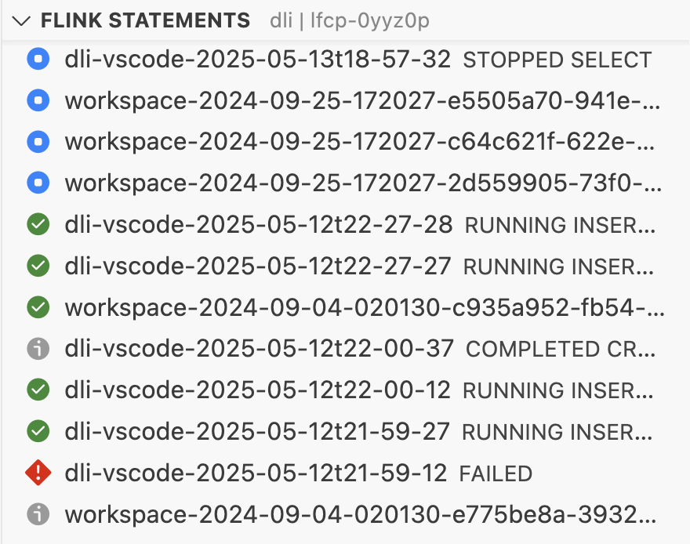

> **Note:** Flink support is currently in **preview**, enable it in the extension settings before using these features.

With the Confluent extension, you can author and execute Flink SQL statements directly from your local code editor, leveraging the full power of VS Code.

## Authoring Flink SQL Statements

- **IntelliSense & Syntax Highlighting:** As you write Flink SQL, the extension provides intelligent code completion, suggestions, and syntax highlighting to help you write correct queries faster.

- **Diagnostics:** Mistakes in your SQL are highlighted before you even run the statement, so you can catch issues early.

## Submitting and Viewing Results

- **Submit to Flink Compute Pool:** Once your statement is ready, submit it to your selected Flink compute pool directly from the editor.

- **View Results:** After submission, see results displayed in the message viewer directly within VS Code.

## Managing Statements in the Extension

- **Statement View:** The extension provides a dedicated view listing all your Flink SQL statements.

- **Load & Edit:** Select any statement from the view to load its query text into the editor. Make changes and submit as a new statement, streamlining your workflow.

