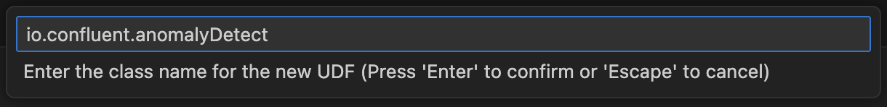

> **Note:** Flink artifacts and UDF support is currently in **preview**. Enable the "Flink Artifacts (Preview)" feature in the extension settings before using these features.

With the Confluent extension, you can develop, test, and deploy User-Defined Functions (UDFs) for Confluent Cloud for Apache Flink directly from VS Code, streamlining your entire UDF development workflow.

