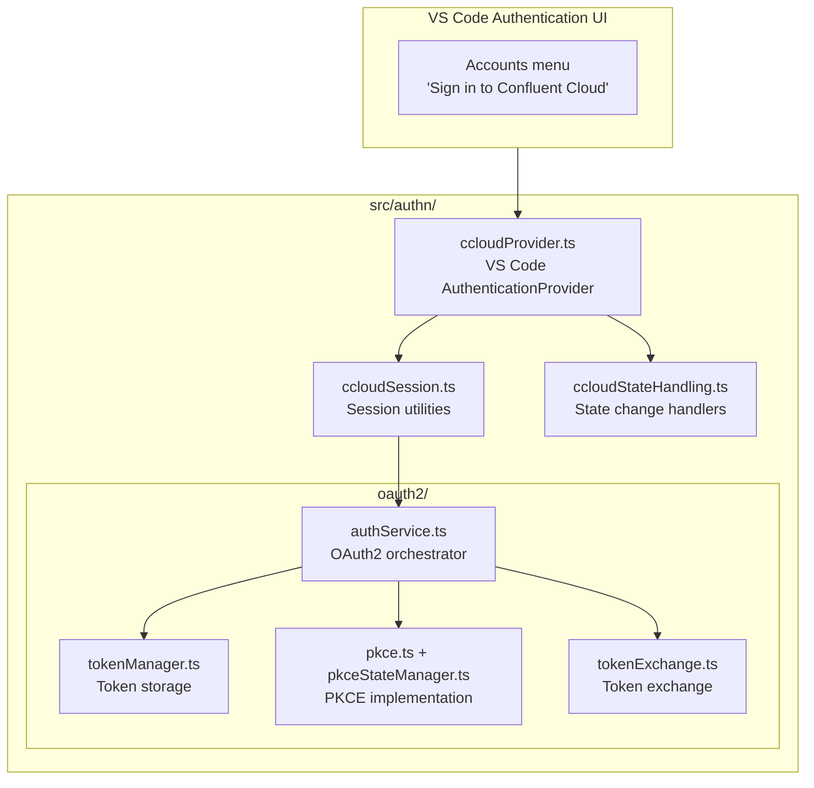
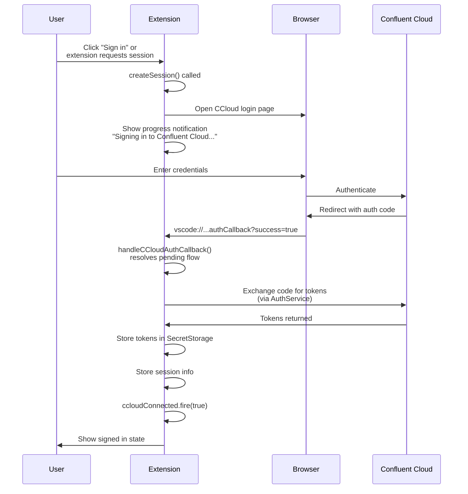
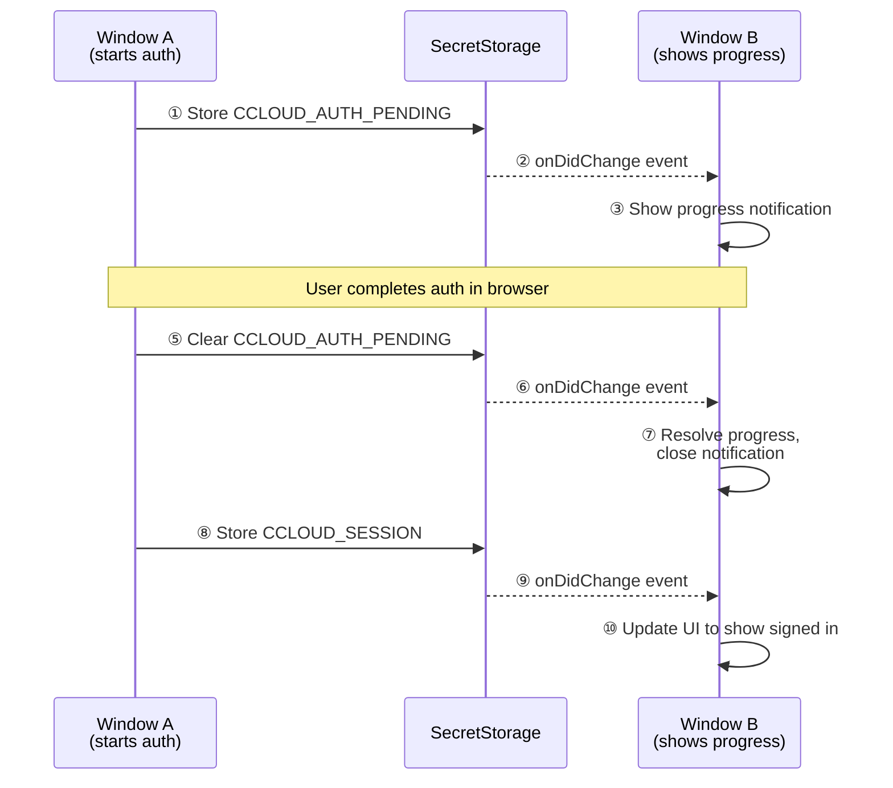
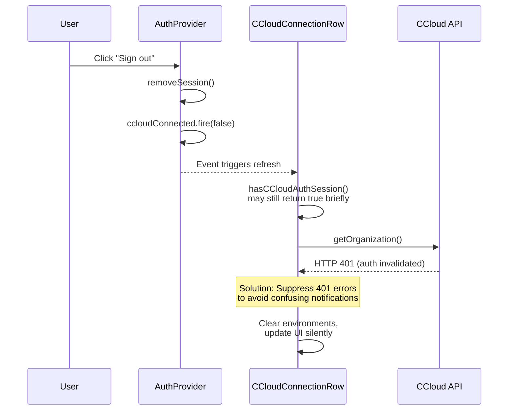

# CCloud Authentication (`src/authn/`)

This directory contains all Confluent Cloud authentication code, including the VS Code Authentication Provider integration and the underlying OAuth2 PKCE implementation.

## Directory Structure

```
src/authn/
├── README.md                    # This file
├── ccloudProvider.ts            # VS Code AuthenticationProvider implementation
├── ccloudSession.ts             # Session utilities (create/get/delete connections)
├── ccloudStateHandling.ts       # Connection state change handlers
├── constants.ts                 # Auth-related constants
├── errors.ts                    # Auth-specific error types
├── types.ts                     # TypeScript types for auth callbacks
├── utils.ts                     # Helper functions
└── oauth2/                      # OAuth2 PKCE implementation
    ├── README.md                # Detailed OAuth2 documentation
    ├── authService.ts           # Main OAuth2 orchestrator
    ├── tokenManager.ts          # Secure token storage
    ├── pkce.ts                  # PKCE cryptographic functions
    ├── pkceStateManager.ts      # PKCE state persistence
    ├── tokenExchange.ts         # Token exchange HTTP calls
    ├── callbackServer.ts        # Local HTTP callback server
    ├── uriHandler.ts            # VS Code URI handler
    ├── config.ts                # OAuth endpoints and settings
    ├── types.ts                 # OAuth2 type definitions
    └── index.ts                 # Public exports
```

## Architecture Overview



## Key Concepts

### VS Code Authentication Provider

The `ConfluentCloudAuthProvider` implements [`vscode.AuthenticationProvider`](https://code.visualstudio.com/api/references/vscode-api#AuthenticationProvider), which integrates with VS Code's built-in authentication system:

- **Accounts Menu Integration**: Users see "Confluent Cloud" in the VS Code Accounts menu
- **Session Management**: VS Code handles session lifecycle and UI
- **Cross-Extension Access**: Other extensions can request CCloud auth via `vscode.authentication.getSession()`

```typescript
// How VS Code calls the provider
class ConfluentCloudAuthProvider implements vscode.AuthenticationProvider {
  // Called when user clicks "Sign in" or extension requests session
  async createSession(): Promise<vscode.AuthenticationSession>

  // Called to check existing sessions
  async getSessions(): Promise<vscode.AuthenticationSession[]>

  // Called when user clicks "Sign out" from Accounts menu
  async removeSession(sessionId: string): Promise<void>
}
```

### Authentication Flow



### Multi-Window Session Sync

VS Code can have multiple windows open, each with its own extension instance. The auth provider coordinates sessions across windows using SecretStorage:



**SecretStorage Keys Used:**
- `CCLOUD_AUTH_PENDING` - Tracks pending auth flow (JSON: `{ startedAt, signInUri }`)
- `CCLOUD_SESSION` - Stores user info for session rehydration
- `CCLOUD_STATE` - Stores connection state (ConnectedState enum)

### Sign-Out Handling

When signing out, a race condition can occur:



**Solution:** The `CCloudConnectionRow.refresh()` method suppresses HTTP 401 errors during sign-out to avoid showing confusing error notifications.

## Usage Examples

### Check if User is Signed In

```typescript
import { hasCCloudAuthSession } from "./authn/ccloudSession";

if (hasCCloudAuthSession()) {
  // User has valid CCloud session
}
```

### Get Current Connection

```typescript
import { getCCloudConnection } from "./authn/ccloudSession";

const connection = await getCCloudConnection();
if (connection?.status.ccloud?.state === ConnectedState.SUCCESS) {
  // Connection is active and authenticated
}
```

### Listen for Auth State Changes

```typescript
import { ccloudConnected } from "./emitters";

ccloudConnected.event((connected: boolean) => {
  if (connected) {
    // User signed in - refresh UI
  } else {
    // User signed out - clear CCloud-specific UI
  }
});
```

### Programmatically Request Sign-In

```typescript
import { getCCloudAuthSession } from "./authn/utils";

// Triggers sign-in flow if not already signed in
const session = await getCCloudAuthSession({ createIfNone: true });
```

## Related Documentation

- [VS Code Authentication Provider API](https://code.visualstudio.com/api/references/vscode-api#AuthenticationProvider)
- [VS Code SecretStorage API](https://code.visualstudio.com/api/references/vscode-api#SecretStorage)
- [`oauth2/README.md`](./oauth2/README.md) - Detailed OAuth2 implementation documentation
