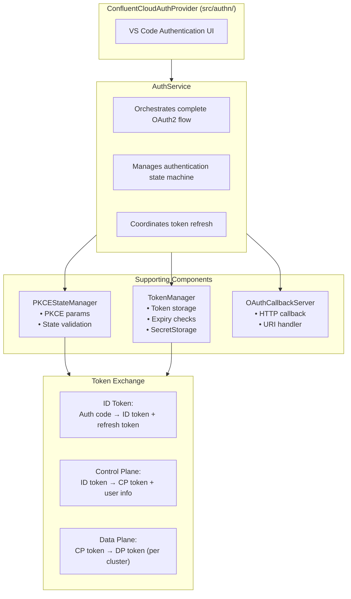
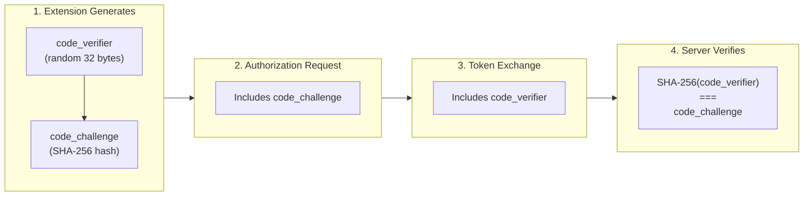
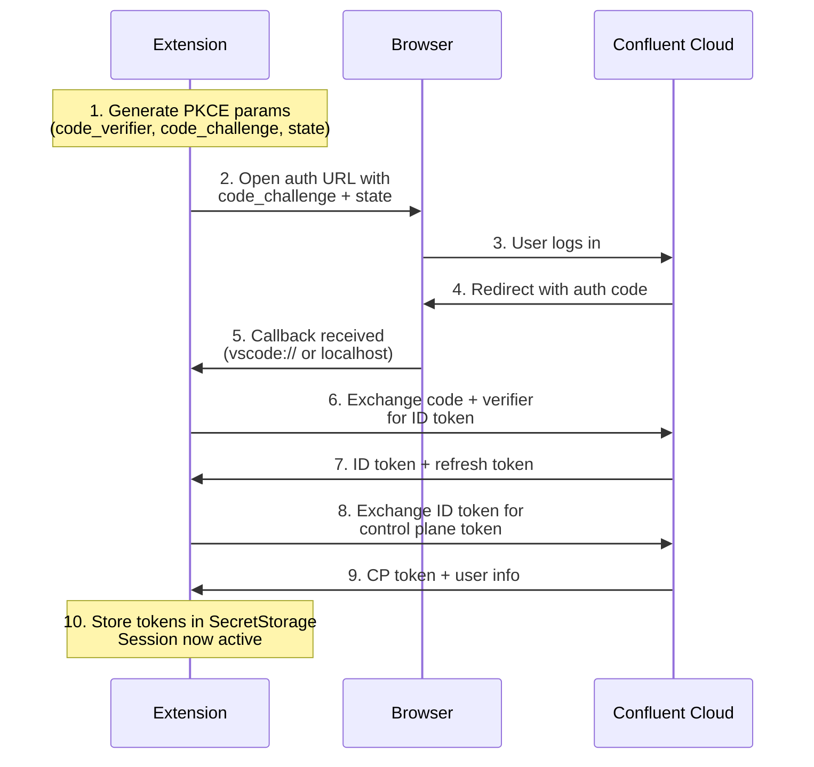
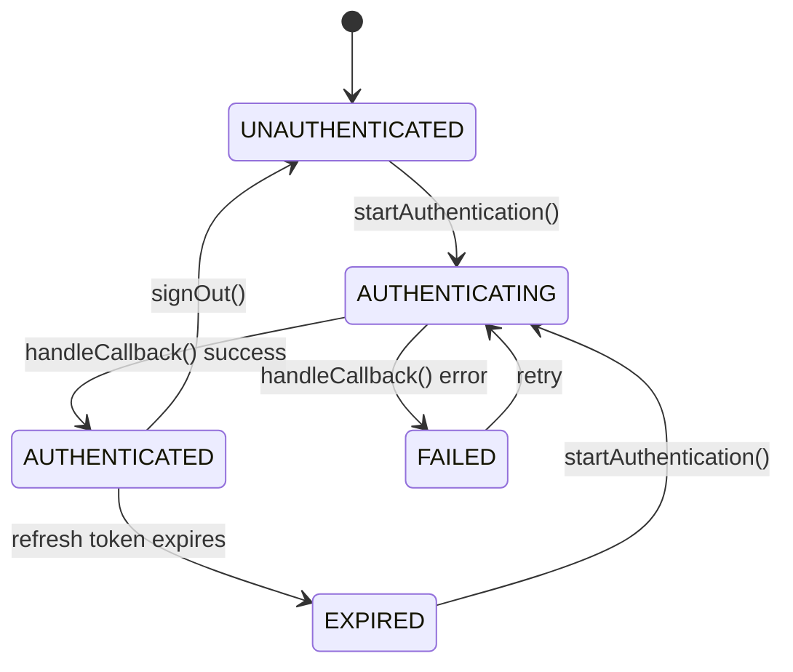
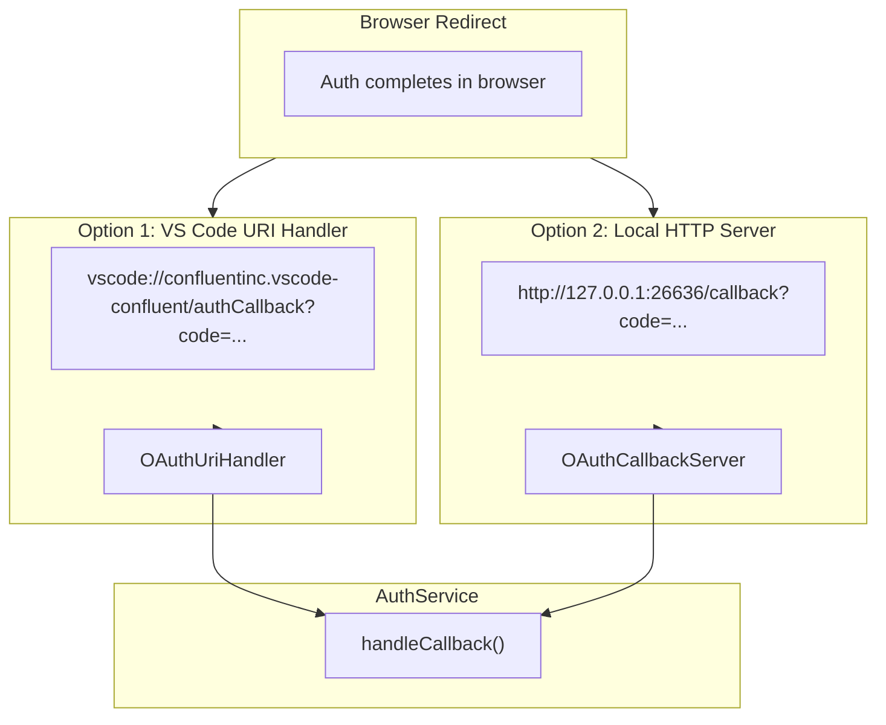
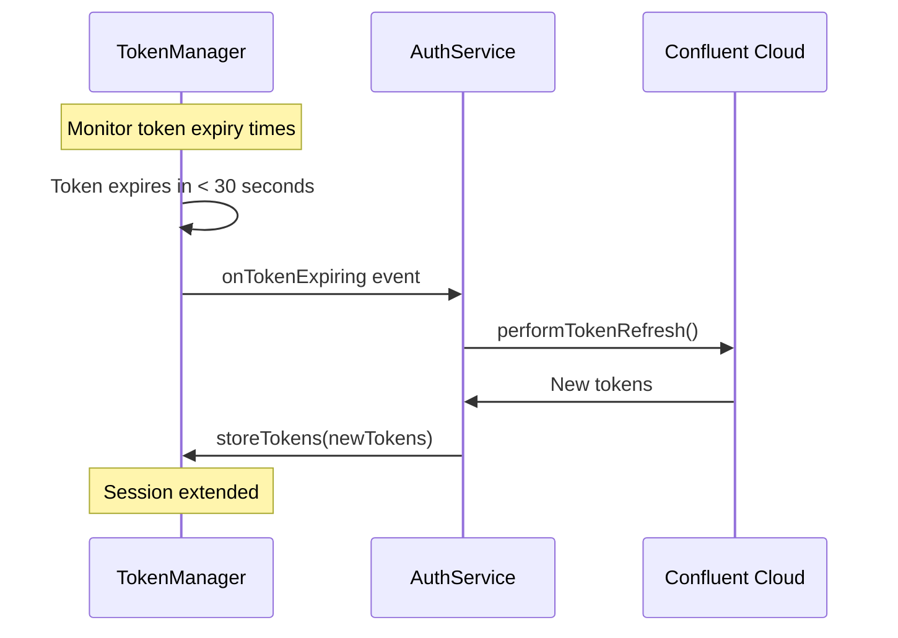

# OAuth2 Authentication Module (`src/authn/oauth2/`)

This directory contains the low-level OAuth2 PKCE implementation for Confluent Cloud authentication. It handles the cryptographic operations, token exchanges, and secure token storage.

## Architecture Overview



## Files

| File | Purpose |
|------|---------|
| `index.ts` | Public exports for the module |
| `authService.ts` | Main orchestrator for OAuth2 flows |
| `types.ts` | TypeScript interfaces for tokens, requests, responses |
| `config.ts` | OAuth endpoints, client IDs, token lifetimes |
| `pkce.ts` | PKCE cryptographic functions (code verifier, challenge) |
| `pkceStateManager.ts` | Persists PKCE state across VS Code restarts |
| `tokenManager.ts` | Secure token storage and expiry management |
| `tokenExchange.ts` | HTTP calls for token exchange operations |
| `callbackServer.ts` | Local HTTP server for OAuth callback |
| `uriHandler.ts` | VS Code URI handler for `vscode://` callbacks |

## OAuth2 PKCE Flow

### What is PKCE?

[PKCE (Proof Key for Code Exchange)](https://oauth.net/2/pkce/) prevents authorization code interception attacks. It's required for public clients (like VS Code extensions) that can't securely store a client secret.



### Token Types

CCloud uses a multi-token architecture:

| Token | Lifetime | Purpose |
|-------|----------|---------|
| **ID Token** | 5 min | Initial authentication proof |
| **Refresh Token** | 8 hours | Obtain new tokens without re-auth |
| **Control Plane Token** | 5 min | CCloud management API calls |
| **Data Plane Token** | 5 min | Kafka/Schema Registry operations |

### Complete Flow



## Key Components

### AuthService

The main coordinator that manages authentication state and orchestrates the flow:



```typescript
class AuthService {
  // Start authentication flow
  async startAuthentication(options?: AuthOptions): Promise<AuthResult>

  // Handle OAuth callback (code exchange)
  async handleCallback(result: OAuthCallbackResult): Promise<AuthResult>

  // Get sign-in URL (reuses PKCE state if valid)
  async getOrCreateSignInUri(): Promise<string>

  // Check if session is valid
  async isAuthenticated(): Promise<boolean>

  // Sign out (clear tokens)
  async signOut(): Promise<void>
}
```

### TokenManager

Securely stores tokens in VS Code's [`SecretStorage`](https://code.visualstudio.com/api/references/vscode-api#SecretStorage):

```typescript
class TokenManager {
  // Store tokens securely
  async storeTokens(tokens: OAuthTokens): Promise<void>

  // Retrieve current tokens
  async getTokens(): Promise<OAuthTokens | null>

  // Check if refresh token is still valid
  async isSessionValid(): Promise<boolean>

  // Clear all tokens (sign out)
  async clearTokens(): Promise<void>

  // Events for token lifecycle
  readonly onTokenExpiring: Event<TokenExpiringEvent>
  readonly onSessionExpired: Event<void>
}
```

### PKCEStateManager

Persists PKCE parameters so token exchange works even if VS Code restarts:

```typescript
class PKCEStateManager {
  // Generate and store new PKCE params
  async createPKCEState(): Promise<PKCEParams>

  // Retrieve stored params (for token exchange)
  async getPKCEState(): Promise<PKCEState | null>

  // Validate state parameter from callback
  async validateState(state: string): Promise<boolean>

  // Clear after successful exchange
  async clearPKCEState(): Promise<void>
}
```

### Token Exchange Functions

Low-level HTTP calls to CCloud endpoints:

```typescript
// Exchange auth code for ID token (uses PKCE verifier)
async function exchangeCodeForIdToken(
  config: OAuthConfig,
  code: string,
  codeVerifier: string
): Promise<IdTokenExchangeResponse>

// Exchange ID token for control plane token + user info
async function exchangeIdTokenForControlPlaneToken(
  config: OAuthConfig,
  idToken: string,
  orgId?: string
): Promise<ControlPlaneTokenExchangeResponse>

// Exchange control plane token for data plane token
async function exchangeControlPlaneTokenForDataPlaneToken(
  controlPlaneUri: string,
  controlPlaneToken: string,
  clusterId?: string
): Promise<DataPlaneTokenExchangeResponse>

// Refresh tokens using refresh token
async function refreshTokens(
  config: OAuthConfig,
  refreshToken: string
): Promise<TokenRefreshResponse>

// Full exchange: code → ID → CP → DP tokens
async function performFullTokenExchange(
  config: OAuthConfig,
  code: string,
  codeVerifier: string,
  orgId?: string
): Promise<OAuthTokens>
```

## Callback Handling

OAuth callbacks can arrive via two mechanisms:



### VS Code URI Handler

For `vscode://confluentinc.vscode-confluent/authCallback?code=...`:

```typescript
class OAuthUriHandler implements vscode.UriHandler {
  handleUri(uri: vscode.Uri): void {
    // Parse query params
    // Validate state parameter
    // Call AuthService.handleCallback()
  }
}
```

### Local HTTP Server

For `http://127.0.0.1:26636/callback?code=...`:

```typescript
class OAuthCallbackServer {
  // Start listening on callback port
  async start(): Promise<void>

  // Stop server
  async stop(): Promise<void>

  // Handle incoming callback request
  private handleCallback(req, res): void
}
```

## Token Refresh Strategy

The extension proactively refreshes tokens before they expire:

```mermaid
gantt
    title 8-Hour Session with Token Refresh
    dateFormat X
    axisFormat %H:%M

    section Refresh Token
    Valid (8 hours)           :active, rt, 0, 480

    section Control Plane Token
    CP Token 1 (5 min)        :cp1, 0, 5
    CP Token 2 (5 min)        :cp2, 5, 10
    CP Token 3 (5 min)        :cp3, 10, 15
    ... continues ...         :cp4, 15, 20
```





## Configuration

OAuth endpoints and settings in `config.ts`:

```typescript
export enum CCloudEnvironment {
  PRODUCTION = "production",
  STAGING = "staging",
  DEVELOPMENT = "development",
}

export const OAUTH_CONSTANTS = {
  CLIENT_ID: "confluent-cloud-vscode",
  SCOPES: "openid email offline_access",
  CALLBACK_PORT: 26636,
  FLOW_TIMEOUT_MS: 5 * 60 * 1000, // 5 minutes
};

export const TOKEN_LIFETIMES = {
  ID_TOKEN_SECONDS: 5 * 60,           // 5 minutes
  CONTROL_PLANE_TOKEN_SECONDS: 5 * 60, // 5 minutes
  DATA_PLANE_TOKEN_SECONDS: 5 * 60,    // 5 minutes
  REFRESH_TOKEN_SECONDS: 8 * 60 * 60,  // 8 hours
};
```

## Error Handling

```typescript
export class TokenExchangeError extends Error {
  constructor(
    message: string,
    public readonly oauthError?: OAuthError,
    public readonly statusCode?: number
  ) {
    super(message);
  }
}

// OAuth error codes that indicate session invalidation
const SESSION_INVALID_ERRORS = ["invalid_grant", "invalid_token"];
```

## Usage Example

```typescript
import { AuthService, AuthState } from "./authn/oauth2";

const authService = AuthService.getInstance();

// Check current state
if (authService.getState() === AuthState.AUTHENTICATED) {
  // Already authenticated
}

// Start authentication
const result = await authService.startAuthentication();
if (result.success) {
  console.log("Authenticated as:", result.tokens?.user?.email);
}

// Listen for session expiration
authService.onSessionExpired(() => {
  // Prompt user to re-authenticate
});
```

## Security Considerations

1. **Tokens in SecretStorage**: All tokens stored via VS Code's encrypted SecretStorage
2. **PKCE Required**: Prevents authorization code interception
3. **State Validation**: CSRF protection for callbacks
4. **Short-lived Tokens**: CP/DP tokens expire in 5 minutes
5. **No Client Secret**: Public client pattern (secret not needed)

## Related Documentation

- [OAuth 2.0 for Native Apps (RFC 8252)](https://datatracker.ietf.org/doc/html/rfc8252)
- [PKCE (RFC 7636)](https://datatracker.ietf.org/doc/html/rfc7636)
- [VS Code SecretStorage API](https://code.visualstudio.com/api/references/vscode-api#SecretStorage)
- [`src/authn/README.md`](../README.md) - High-level auth provider and directory overview
