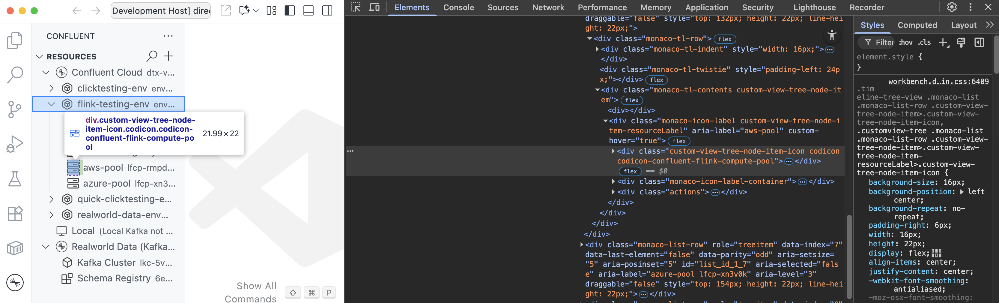
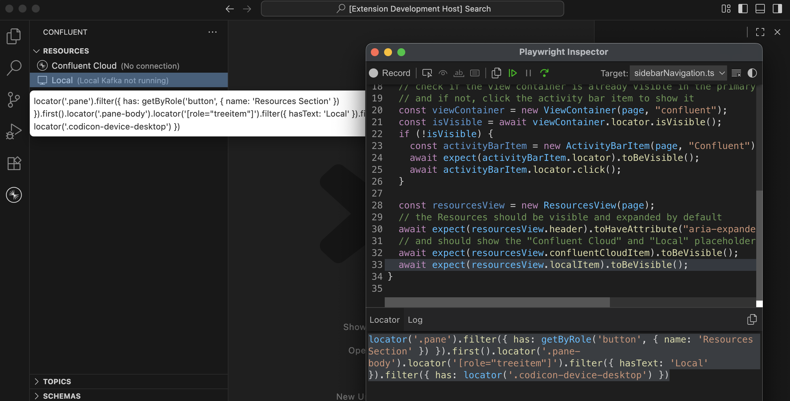

# VS Code Extension Tests

This extension uses multiple testing approaches to ensure quality:

- **[Mocha](https://mochajs.org)** for unit and integration tests (with
  [Sinon](https://sinonjs.org/) for stubbing)
- **[Playwright](https://playwright.dev/)** for functional webview tests and end-to-end (E2E) tests

Unit and integration tests are co-located with production code in `*.test.ts` files, while
functional and E2E tests have dedicated locations described below.

## Folder structure

- [`./e2e/`](./e2e/) contains the E2E test specs, utility functions, and page object models.
- [`./fixtures/`](./fixtures/) contains the fixtures for all tests. Use the `loadFixture` function
  in [`./fixtures/utils.ts`](fixtures/utils.ts) to read a particular fixture file.
- [`./stubs/`](./stubs/) contains commonly-used Sinon
  [stub](https://sinonjs.org/releases/latest/stubs/) helper functions that are used by the Mocha
  tests.
- [`./unit/`](./unit/) contains utility functions and fixtures for Mocha tests (`*.test.ts`)
  co-located with the production code in the [`src/`](../src) directory.

## E2E testing with Playwright

The E2E tests use [Playwright with Electron](https://playwright.dev/docs/api/class-electron) to
launch VS Code and interact with it programmatically.

### E2E folder structure

- [`./e2e/playwright.config.ts`](./e2e/playwright.config.ts) contains the Playwright configuration
  for E2E tests. (The root [`playwright.config.ts`](../playwright.config.ts) is used for functional
  webview tests via `gulp functional`.)
- [`./e2e/specs/`](./e2e/specs/) contains the test files.
- [`./e2e/utils/`](./e2e/utils/) contains utility functions for the tests.
- [`./e2e/objects/`](./e2e/objects/) contains [page object models](https://playwright.dev/docs/pom)
  for the tests.

<!-- prettier-ignore -->
> [!NOTE]
> What's the difference between `gulp e2e` and `gulp functional`?
>
> `gulp e2e` runs the E2E tests in the `tests/e2e/specs` directory, whereas `gulp functional` runs
> the functional tests under `src/webview/` (and its subdirectories). Both use Playwright to run the
> tests. However, the E2E tests run in a OS-native Electron window rather than just testing web
> views in a browser environment.

### Running the E2E tests

We currently run the tests against Confluent Cloud production environment. We may add support for
running against other non-production environments in the future.

#### Prerequisites

First, we'll need to install the dependencies:

```bash
make install-dependencies
```

#### Configure environment variables

Next, we'll need a `.env` file with the following environment variables depending on which test(s)
are being run:

- For running tests requiring a Confluent Cloud connection (tagged with `@ccloud`):
  - `E2E_USERNAME`: Confluent Cloud username
  - `E2E_PASSWORD`: Confluent Cloud password
- For running tests requiring a direct connection (tagged with `@direct`) using CCloud API keys:
  - Including a configuration for a Kafka cluster:
    - `E2E_KAFKA_API_KEY`: API key for the Kafka cluster
    - `E2E_KAFKA_API_SECRET`: API secret for the Kafka cluster
    - `E2E_KAFKA_BOOTSTRAP_SERVERS`: Bootstrap servers for the Kafka cluster
  - Including a configuration for a Schema Registry:
    - `E2E_SR_API_KEY`: API key for the Schema Registry server
    - `E2E_SR_API_SECRET`: API secret for the Schema Registry server
    - `E2E_SR_URL`: URL for the Schema Registry server

If you're a Confluent engineer, you can run the following commands to populate the `.env` file with
the environment variables listed above:

```bash
vault login -method=oidc -path=okta
make setup-test-env
```

#### Running tests

To run all existing E2E tests:

```bash
gulp e2e
```

To run a specific test, use the `-t` flag:

```bash
gulp e2e -t "<test-name>"
# For example, to run the test for submitting a Flink statement with a SELECT query:
gulp e2e -t "should submit Flink statement - SELECT"
```

The `.only` pattern is also supported by using
[`test.describe.only`](https://playwright.dev/docs/api/class-test#test-describe-only) and/or
[`test.only`](https://playwright.dev/docs/api/class-test#test-only) in the test file.

#### Running the tests using a specific VS Code version

If you want to run the tests in a specific VS Code version, set the `VSCODE_VERSION` environment
variable to a valid VS Code version (like `1.104.0`) or to `insiders` to use the latest VS Code
Insiders build.

For example, to run the tests in VS Code `1.104.0`:

```bash
VSCODE_VERSION=1.104.0 gulp e2e
```

### Writing E2E tests

E2E tests use
[`electron-playwright-helpers`](https://github.com/spaceagetv/electron-playwright-helpers?tab=readme-ov-file#functions)
to interact with native system dialogs and Electron-specific functionality.

To create a new E2E test:

1. **Check for existing patterns.** Review tests in `tests/e2e/specs` for similar functionality.
   Create a new file named `<feature-name>.spec.ts` if needed.

1. **Start with the basic structure.** Use this example as a starting point:

   ```typescript
   import { expect } from "@playwright/test";
   import { test } from "../baseTest";
   import { ConnectionType } from "../connectionTypes";
   import { TopicsView } from "../objects/views/TopicsView";
   import { TopicItem } from "../objects/views/viewItems/TopicItem";
   import { Tag } from "../tags";

   test.describe("<feature-name>", { tag: [Tag.FeatureNameHere] }, () => {
     // Use the `connectionItem` fixture to automatically set up a connection for your test, if the
     // test requires a CCloud, local, and/or direct connection.
     test.use({ connectionType: ConnectionType.Ccloud });

     test.beforeEach(async ({ connectionItem }) => {
       // The connectionItem fixture ensures the connection is set up and expanded in the Resources
       // view, and handles teardown automatically after the test completes.
       await expect(connectionItem.locator).toHaveAttribute("aria-expanded", "true");
     });

     test("should open message viewer from a topic", async ({ page }) => {
       // Use existing page object models for common interactions
       const topicsView = new TopicsView(page);
       await topicsView.loadTopics(ConnectionType.Ccloud, SelectKafkaCluster.FromResourcesView);

       // Find a specific topic using the `.topics` locator getter method
       const targetTopic = topicsView.topics.filter({ hasText: "my-topic" }).first();
       await expect(targetTopic).toBeVisible();

       // Use the TopicItem page object to interact with the topic
       const topicItem = new TopicItem(page, targetTopic);
       // Perform actions like opening the message viewer
       const messageViewer = await topicItem.clickViewMessages();
       await expect(messageViewer.content).toBeVisible();
     });
   });
   ```

1. **Leverage fixtures for setup and teardown.** Playwright
   [fixtures](https://playwright.dev/docs/test-fixtures) are set up in
   [`tests/e2e/baseTest.ts`](./e2e/baseTest.ts). These mainly include common setup and teardown
   operations for different connection types (CCloud, local, and/or direct) that you can use in your
   tests.

1. **Reuse page object models.** Review existing
   [page object models](https://playwright.dev/docs/pom) in [`tests/e2e/objects`](./e2e/objects/) to
   see if you can reuse or extend them for commonly-used locators and interactions.

   - Before creating or extending page object models, you'll need to determine which locator(s) are
     needed for the test(s). Here are some common ways to find the right locators:

     - **Inspect the DOM directly**: Open VS Code and navigate to `Help > Toggle Developer Tools` to
       inspect the DOM while clicking around the UI. This is useful for understanding the structure
       of the elements you want to interact with.

       

     - **Use Playwright inspector in debug mode**: Start debugging your test and use the "Record"
       button in the Playwright inspector to record actions and generate locators automatically.
       This even works for webview iframes!

       ```bash
       PWDEBUG=1 gulp e2e -t "<test-name>"
       ```

       

#### Tips for writing tests

1. **Use narrowly-focused locators to avoid multiple matches.** Playwright runs in
   [strict mode](https://playwright.dev/docs/locators#strictness) by default, which means locators
   that match multiple elements will throw an error. To avoid this:

   - Use specific attributes like `data-testid`, `role`, or `aria-label` when possible
   - Chain locators to narrow the scope: `page.locator('.container').getByText('Submit')`
   - Use `.first()`, `.last()`, or `.nth()` only when you genuinely need one of multiple identical
     elements
   - Use `.filter()` to narrow down matches based on additional criteria

   ```typescript
   // ❌ May match multiple elements in strict mode
   await page.getByText("Hello").click();

   // ✅ Narrow the scope using chaining
   await page.locator(".greeting-container").getByText("Hello").click();

   // ✅ Use .first() only when multiple matches are expected
   await page.getByText("Hello").first().click();

   // ✅ Filter by additional criteria
   await page.getByRole("button").filter({ hasText: "Submit" }).click();
   ```

1. **Always use [auto-await](https://playwright.dev/docs/actionability) patterns instead of
   arbitrary timeouts.** Playwright's assertions automatically wait and retry until the condition is
   met (or timeout). This makes tests more reliable and faster than using `page.waitForTimeout()`,
   which may not behave as expected on different systems (especially tests run locally versus in
   CI).

   ```typescript
   // ❌ Avoid arbitrary timeouts - brittle and slow
   await page.waitForTimeout(3000);
   const text = await page.locator(".status").textContent();
   if (text === "Ready") {
     // ...
   }

   // ✅ Use auto-waiting assertions - reliable and fast
   await expect(page.locator(".status")).toHaveText("Ready");

   // ✅ Wait for elements to be in the right state before interacting
   await expect(button).toBeEnabled();
   await button.click();

   // ✅ Wait for visibility before proceeding
   await expect(page.locator(".modal")).toBeVisible();
   await expect(page.locator(".loading-spinner")).not.toBeVisible();
   ```

1. **For webview `iframe` elements, set the `data-testid` attribute** on elements you're testing.
   (See existing implementations
   [here](https://github.com/search?q=repo%3Aconfluentinc%2Fvscode+data-testid+language%3AHTML&type=code&l=HTML).)
   This makes it easy to locate elements within your test code or page object model(s).

1. **Skip bundling when iterating on tests.** If you haven't changed production code in the `src`
   directory, use `gulp e2eRun` instead of `gulp e2e` to bypass the bundling step and speed up test
   iteration.

### Debugging the E2E tests

Please refer to the [Playwright - Debugging Tests](https://playwright.dev/docs/debug) documentation
for a detailed guide on debugging Playwright tests.

To debug a particular test, set the `PWDEBUG` environment variable to `1` and run the test:

```bash
PWDEBUG=1 gulp e2e -t "<test-name>"
```

This will launch the test with a Playwright inspector window to debug the test. The Playwright
inspector is extremely useful to pick locators in the VS Code window to use in the tests.
